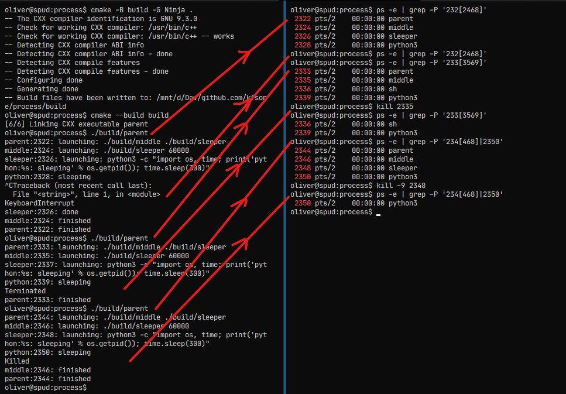

# Demonstration of failure to propagate kill signals.

## Building
```shell
cmake -B build -G Ninja .    # configure for ninja build tool
cmake --build build          # compile
```

## Running

```shell
./build/parent
```

The parent uses `system(3)` to launch a subprocess, which then also
uses `system(3)` to launch a subprocess, with the final process
launching a python command that uses sleep to keep things alive for
60s.

Each process identifies its PID.

If you press CTRL-C the whole chain will abort cleanly.

On Linux, but not some BSDs, if you send a SIGINT to some of the
processes, the whole chain will die.

However, if you have a second terminal open and "crash" one of the
child processes... 




